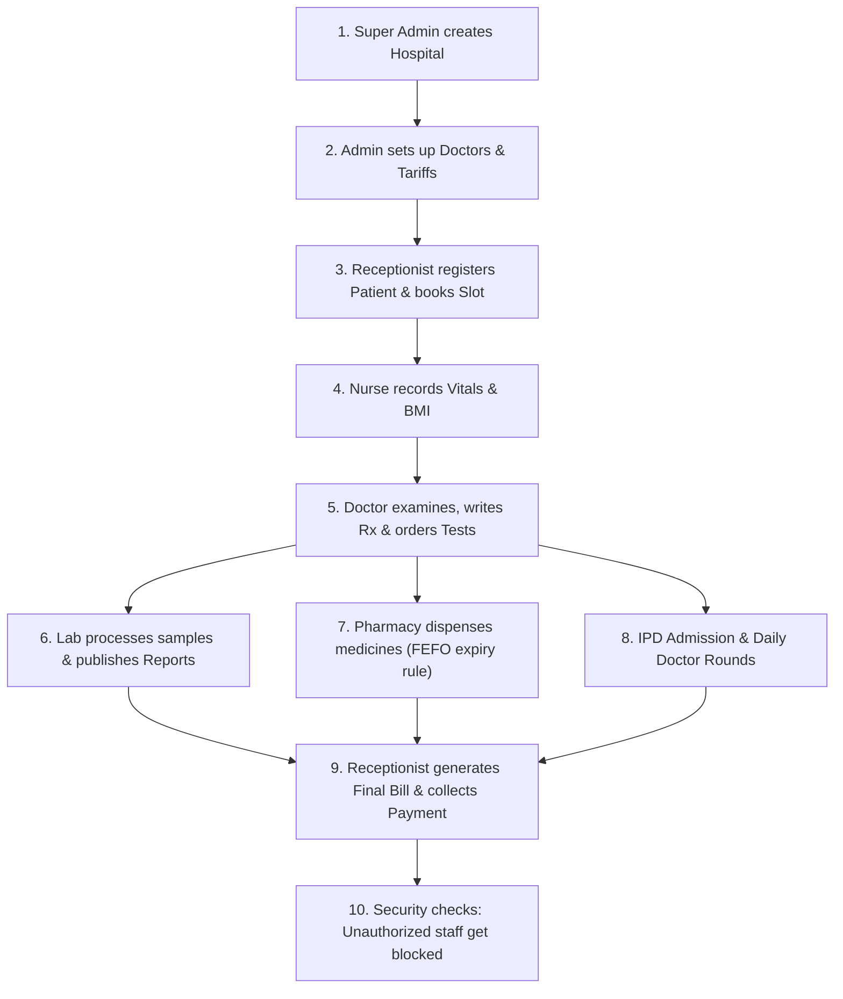
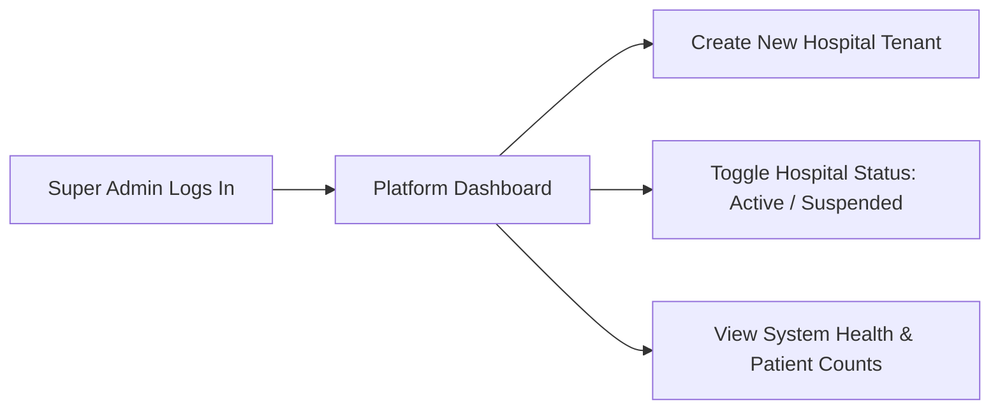
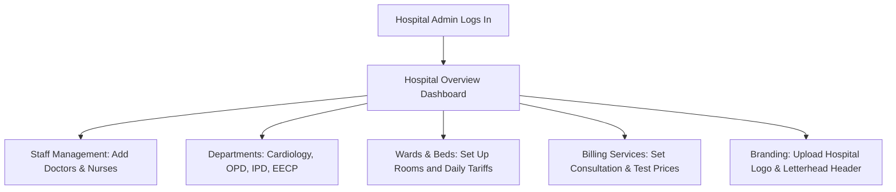
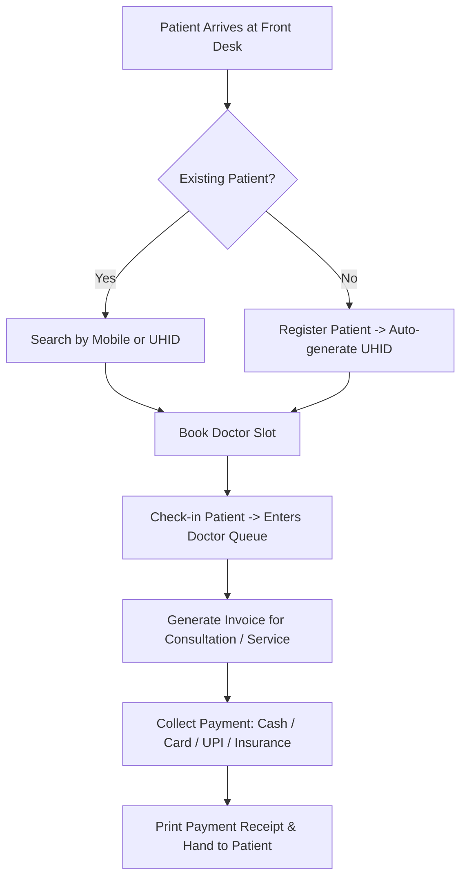
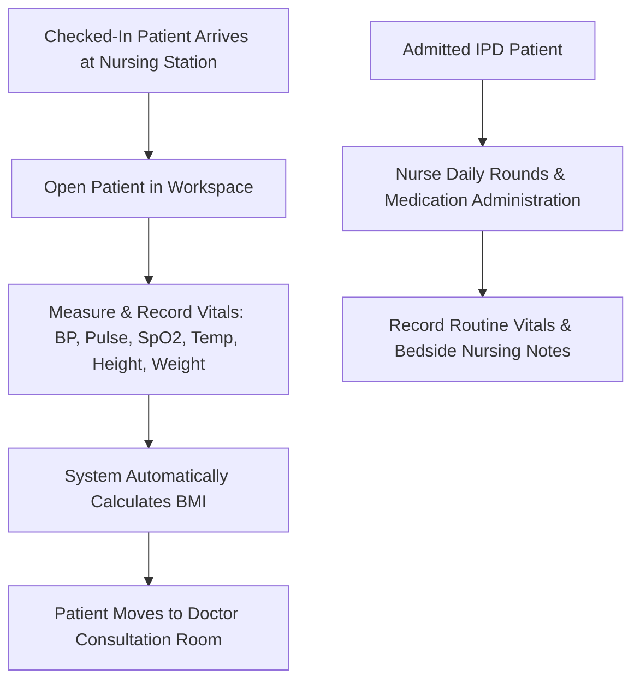
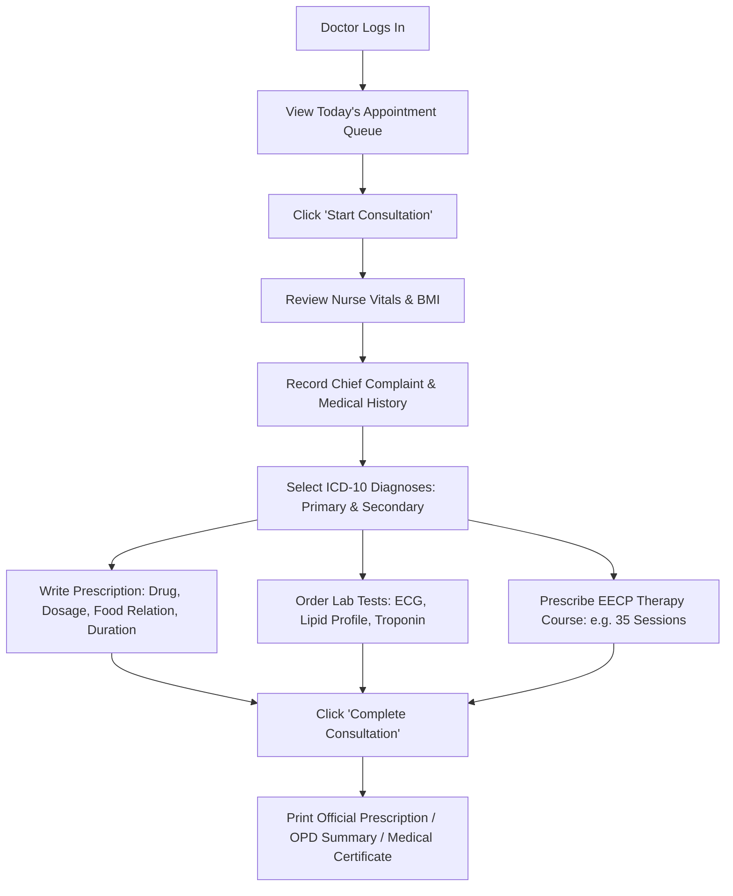
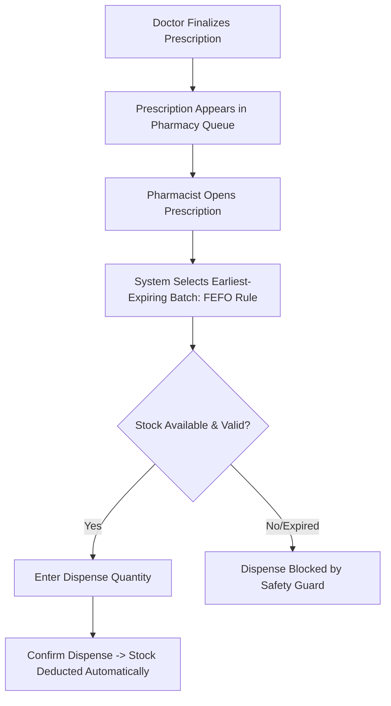
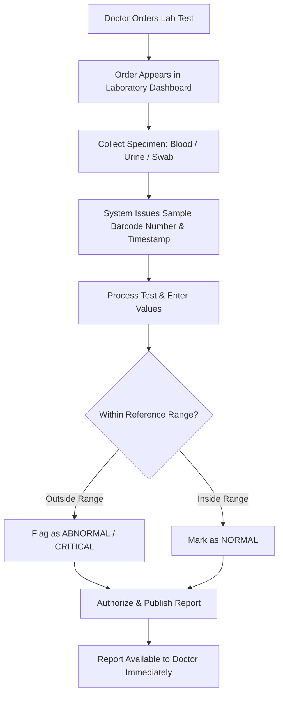
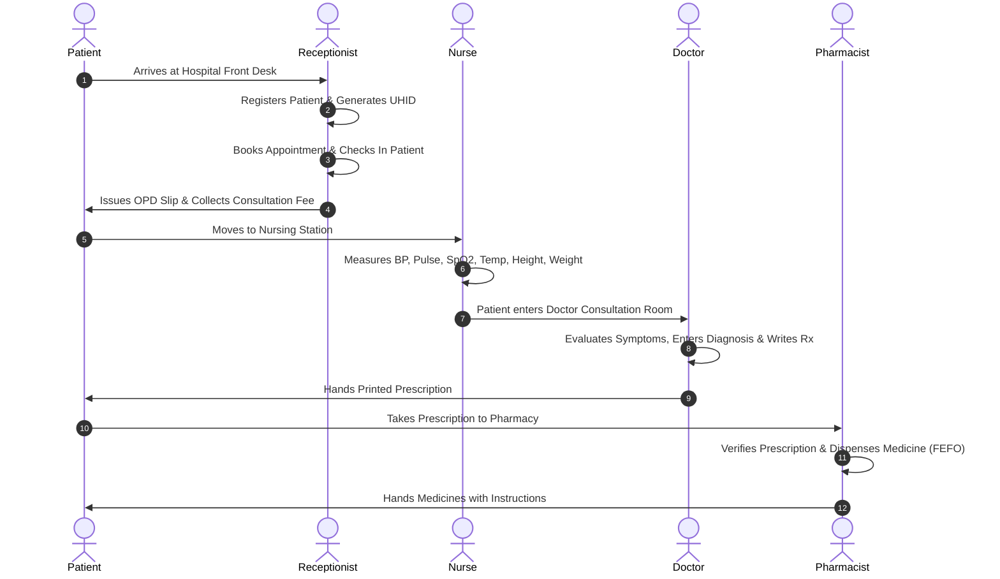
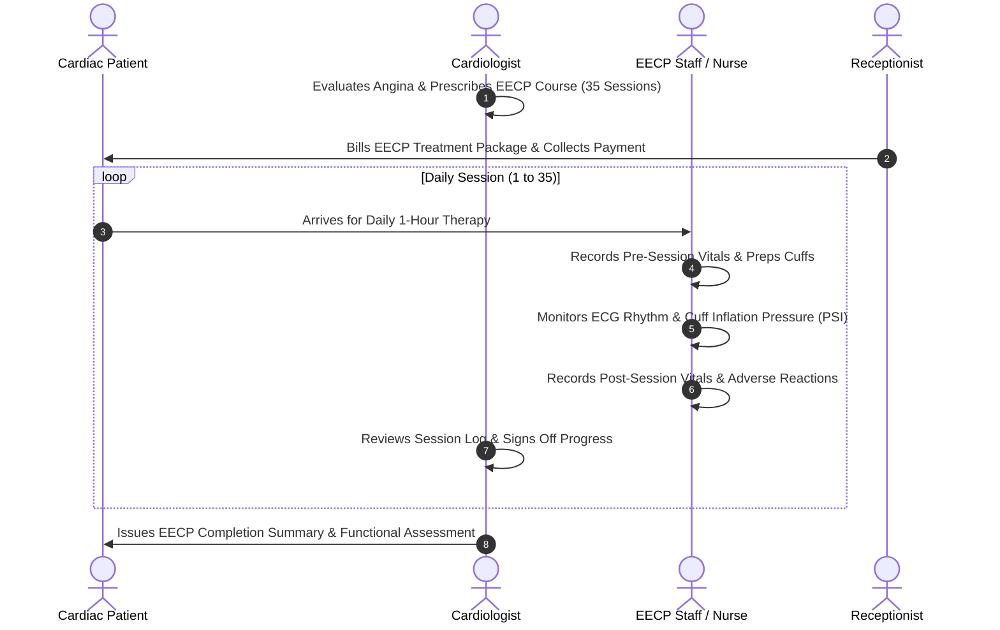

# MediSync HMS — Complete Operations & Role-Based User Guide

> **A Plain-Language, Non-Technical Handbook for Hospital Staff and Administrators**  
> *Everything you need to know about who can do what, step-by-step hospital workflows, visual flow diagrams, and how we test the system.*

---

## Table of Contents
1. [How We Test This System (In Simple Terms)](#1-how-we-test-this-system-in-simple-terms)
2. [Hospital Roles Overview at a Glance](#2-hospital-roles-overview-at-a-glance)
3. [Super Admin (Platform Owner)](#3-super-admin-platform-owner)
4. [Hospital Admin (Hospital Operations Manager)](#4-hospital-admin-hospital-operations-manager)
5. [Receptionist (Front Desk & Billing)](#5-receptionist-front-desk--billing)
6. [Nurse (Triage, Vitals & Ward Care)](#6-nurse-triage-vitals--ward-care)
7. [Doctor (Consultations, Prescriptions & Inpatient Care)](#7-doctor-consultations-prescriptions--inpatient-care)
8. [Pharmacist (Medicine Inventory & Dispensing)](#8-pharmacist-medicine-inventory--dispensing)
9. [Lab Staff (Pathology & Investigation Results)](#9-lab-staff-pathology--investigation-results)
10. [End-to-End Patient Journey Flowcharts](#10-end-to-end-patient-journey-flowcharts)
    - [OPD Walk-in Journey](#a-opd-walk-in-patient-journey)
    - [EECP Cardiac Therapy Journey](#b-eecp-cardiac-therapy-journey)
    - [IPD Inpatient Hospital Stay Journey](#c-ipd-inpatient-hospital-stay-journey)
11. [Master Role Permissions Matrix](#11-master-role-permissions-matrix)

---

## 1. How We Test This System (In Simple Terms)

Before rolling out the software to a live hospital, we test it **just like a real hospital working in real life**:



### What We Actually Verify During Testing:
1. **Real User Action Simulation:** We log in as each real user (Admin, Doctor, Nurse, Receptionist, Pharmacist, Lab Tech) and execute their tasks.
2. **Database Verification:** Every button click is checked in the database to guarantee records are saved correctly (e.g., bills balance out, bed numbers update, medicine counts reduce).
3. **Security & Boundary Checks:** We verify that unauthorized roles cannot peek at or tamper with records they don't own (e.g., a receptionist cannot modify a doctor's diagnosis, a pharmacist cannot collect hospital bills).
4. **Tenant Isolation:** If Hospital A is logged in, they can never see Hospital B's patients or data.

---

## 2. Hospital Roles Overview at a Glance

| Role | Primary Responsibility | Daily Work Location |
| :--- | :--- | :--- |
| **Super Admin** | Platform Governance & Hospital Onboarding | Super Admin Portal (`/super-admin`) |
| **Hospital Admin** | Hospital Operations, Staffing, Rates & Wards | Admin Dashboard (`/hospital-admin`) |
| **Receptionist** | Patient Registration, Appointments, Billing & Receipts | Front Desk Desk (`/hospital-admin/appointments`) |
| **Nurse** | Vitals Checking, Inpatient Medication & Nursing Notes | Triage & Ward Station (`/hospital-admin/encounters`) |
| **Doctor** | OPD Consultations, Prescriptions, EECP & Rounds | Consultation Room (`/hospital-admin/consultation/:id`) |
| **Pharmacist** | Drug Inventory, Stock Tracking & Dispensing | Hospital Pharmacy (`/hospital-admin/pharmacy`) |
| **Lab Staff** | Specimen Collection, Lab Tests & Reports | Diagnostics Lab (`/hospital-admin/laboratory`) |

---

## 3. Super Admin (Platform Owner)

The **Super Admin** owns the cloud platform. They license the software to hospitals and manage system health.



### ✅ What They CAN Do:
1. **Create New Hospitals:** Enter hospital name, domain, address, admin email, and issue initial credentials.
2. **Activate / Suspend Hospitals:** Toggle hospital status. If a hospital account is suspended, all staff under that hospital are immediately locked out.
3. **View Platform Telemetry:** View total hospitals registered, active subscriptions, and aggregate patient volumes across the SaaS.
4. **System Diagnostics:** Check database health and environment status via the Setup portal.

### ❌ What They CANNOT Do:
1. **No Clinical Interference:** Cannot write prescriptions, view personal consultation notes, or modify medical diagnoses.
2. **No Hospital Staff Role:** Cannot check in patients or dispense pharmacy stock.

---

## 4. Hospital Admin (Hospital Operations Manager)

The **Hospital Admin** manages the individual hospital building, doctors, nurses, tariffs, and facility beds.



### ✅ What They CAN Do:
1. **Manage Staff Accounts:** Create user accounts for Doctors, Nurses, Receptionists, Pharmacists, and Lab Technicians. Set doctor consultation fees and license numbers.
2. **Configure Departments:** Set up clinical departments (e.g., Cardiology, EECP, General Medicine, Pathology).
3. **Set Up Doctor Rosters:** Configure doctor working days, shift timings (e.g., 09:00 AM – 01:00 PM), and 15-minute slot intervals.
4. **Manage Wards & Beds:** Create wards (ICU, CCU, Deluxe, General) and assign room/bed numbers with daily rates.
5. **Manage Service Pricing:** Set prices for OPD consultation, lab tests, nursing fees, and procedure charges.
6. **Set Letterhead Branding:** Upload hospital logo, address, contact phone, and tax numbers (GSTIN) that appear on all printed prescriptions and invoices.
7. **View Financial Reports:** View hospital-wide revenue collection, bed occupancy rates, and patient census figures.

### ❌ What They CANNOT Do:
1. **No Clinical Editing:** Cannot edit a doctor's finalized prescription or modify patient medical diagnoses.
2. **No Lab Tampering:** Cannot enter or alter laboratory investigation results.

---

## 5. Receptionist (Front Desk & Billing)

The **Receptionist** is the front face of the hospital. They welcome patients, book appointments, check them in, and collect payments.



### ✅ What They CAN Do:
1. **Register Patients:** Enter patient name, mobile number, date of birth, blood group, gender, and address. The system automatically issues a unique **UHID** (e.g., `UHID-2026-0001`).
2. **Prevent Duplicates:** The system automatically identifies existing records if the same mobile number is entered.
3. **Book Appointments:** Pick an available date and time slot for a specific doctor.
4. **Check-In Patients:** When the patient reaches the waiting room, mark them as **Checked-In**, notifying the nurse and doctor.
5. **Generate Bills & Invoices:** Create bills for OPD consultations, diagnostic services, or bed charges.
6. **Collect Payments:** Record payments using Cash, UPI, Credit Card, or Insurance, and print official stamped receipts.

### ❌ What They CANNOT Do:
1. **No Medical Actions:** Cannot write prescriptions, enter vitals, or view clinical examination findings.
2. **No Dispensing:** Cannot dispense medications from the pharmacy.
3. **No Clinical Modifications:** Cannot change doctor progress notes or cancel orders without administrative approval.

---

## 6. Nurse (Triage, Vitals & Ward Care)

The **Nurse** prepares patients for doctors, captures vital signs, and provides ongoing bedside care for admitted patients.



### ✅ What They CAN Do:
1. **Record Vital Signs:** Enter Blood Pressure (Systolic/Diastolic), Pulse Rate, Oxygen Saturation (SpO2), Body Temperature, Respiratory Rate, Height, and Weight.
2. **Automated Body Mass Index (BMI):** The system automatically computes BMI and flags values (Normal, Overweight, Obese).
3. **Nursing Notes for Inpatients:** Record daily bedside observations, patient mood, hygiene, and doctor-ordered nursing care.
4. **View Lab Orders:** View which tests have been requested by the doctor to prepare the patient.

### ❌ What They CANNOT Do:
1. **No Prescribing:** Cannot write or finalize medical prescriptions.
2. **No Altering Diagnoses:** Cannot assign or change ICD-10 medical diagnoses.
3. **No Discharge Sign-Off:** Cannot discharge an inpatient without doctor clearance.

---

## 7. Doctor (Consultations, Prescriptions & Inpatient Care)

The **Doctor** manages patient clinical care, examines cardiac symptoms, writes digital prescriptions, orders lab investigations, prescribes EECP, and clears inpatients for discharge.



### ✅ What They CAN Do:
1. **View Appointment Queue:** View today’s checked-in patients waiting outside their room.
2. **Document Clinical Consultation:**
   - Record Chief Complaints, History of Present Illness (HPI), and Cardiac Risk Factors.
   - Enter Physical & Systemic Examination notes (Cardiovascular, Respiratory, etc.).
3. **Assign Diagnoses:** Select standardized ICD-10 diagnoses (e.g., *I20.9 Angina Pectoris*, *I10 Essential Hypertension*).
4. **Digital Prescriptions (Rx):** Search medicines, pick dosage (e.g., *1 Tablet*), frequency (e.g., *1-0-1*), duration (*10 Days*), and meal instruction (*After Food*).
5. **Order Investigations:** Order ECG, 2D Echo, Blood tests, or Troponin-I. Orders automatically appear in the Laboratory portal.
6. **Prescribe EECP Cardiac Therapy:** Prescribe EECP therapy (e.g., 35 sessions) with clinical rationale and enroll patient into EECP course tracking.
7. **Conduct Inpatient Rounds:** Record daily Subjective, Objective, Assessment, and Plan (SOAP) clinical progress notes.
8. **Discharge Summaries:** Authorize patient discharge, summarize hospital stay, specify discharge medicines, and sign off medical clearance.
9. **Export Documents:** Instantly print or PDF-download Official Prescriptions, Medical Certificates, and Referral Letters.

### ❌ What They CANNOT Do:
1. **No Financial Modification:** Cannot collect bill payments, modify cash totals, or issue receipts.
2. **No Inventory Changes:** Cannot edit pharmacy stock levels or bypass expiry checks.

---

## 8. Pharmacist (Medicine Inventory & Dispensing)

The **Pharmacist** manages the medicine storage room and safely dispenses doctor-prescribed medications using standard healthcare safety rules.



### ✅ What They CAN Do:
1. **Maintain Drug Formulary:** Manage medicine names, generic names, strengths (e.g., 500mg), dosage forms (Tablet, Syrup, Injection), and manufacturers.
2. **Receive Batches & Stock:** Add stock batches with batch number, purchase cost, MRP, quantity, and expiry date.
3. **FEFO Safe Dispensing:** When dispensing, the system automatically enforces **First-Expired, First-Out (FEFO)** so older valid medicines are dispensed before newer ones.
4. **Dispense Prescriptions:** Process doctor-written prescriptions, dispense full or partial quantities, and update remaining balances.
5. **View Reorder Warnings:** Monitor low-stock and upcoming batch expirations.

### ❌ What They CANNOT Do:
1. **No Changing Prescriptions:** Cannot alter the doctor's prescribed medicine name, strength, or frequency.
2. **No Dispensing Expired Stock:** The software strictly rejects dispensing from an expired batch.
3. **No Over-Dispensing:** The software prevents dispensing more than the doctor prescribed.

---

## 9. Lab Staff (Pathology & Investigation Results)

The **Lab Staff** handles diagnostic test orders, collects blood/tissue samples, and enters lab results.



### ✅ What They CAN Do:
1. **Access Lab Work Queue:** View all active test orders from OPD and IPD doctors.
2. **Collect Samples:** Record specimen type (e.g., Whole Blood, Serum, Urine), collection timestamp, and sample barcode number.
3. **Enter Test Results:** Fill in numeric values, qualitative notes, or diagnostic impressions.
4. **Abnormal & Critical Flags:** Enter test results with reference ranges; out-of-bound values are highlighted with yellow or red warning tags.
5. **Authorize & Finalize:** Sign off the verified test report so the doctor can review it immediately.

### ❌ What They CANNOT Do:
1. **No Tampering After Finalization:** Once verified and published, lab reports become immutable to protect legal integrity.
2. **No Prescribing Medicines:** Cannot order medications or prescribe treatments.

---

## 10. End-to-End Patient Journey Flowcharts

### A. OPD Walk-in Patient Journey


---

### B. EECP Cardiac Therapy Journey


---

### C. IPD Inpatient Hospital Stay Journey
```mermaid
sequenceDiagram
    autonumber
    actor Pat as Patient
    actor Doc as Doctor
    actor Rec as Receptionist
    actor Nur as Ward Nurse

    Doc->>Rec: Doctor recommends Inpatient Admission
    Rec->>Rec: Admits Patient to Ward (e.g. CCU Bed 04)
    Rec->>Nur: Bed marked OCCUPIED; Patient transferred to Ward
    loop Daily Hospital Stay
        Nur->>Nur: Records Bedside Vitals & Nursing Observations
        Doc->>Doc: Conducts Ward Rounds & Enters Daily SOAP Progress Note
    end
    Doc->>Doc: Prepares & Signs Comprehensive Discharge Summary
    Rec->>Rec: Generates Final Consolidated Bill (Beds + Tests + Meds)
    Rec->>Pat: Collects Outstanding Balance & Issues Discharge Clearance
    Rec->>Rec: Bed marked AVAILABLE for next patient
```

---

## 11. Master Role Permissions Matrix

| Feature / Screen | Super Admin | Hospital Admin | Receptionist | Nurse | Doctor | Pharmacist | Lab Staff |
| :--- | :---: | :---: | :---: | :---: | :---: | :---: | :---: |
| **Platform Hospitals Management** | ✅ Full | ❌ | ❌ | ❌ | ❌ | ❌ | ❌ |
| **Hospital Branding & Settings** | ❌ | ✅ Full | ❌ | ❌ | ❌ | ❌ | ❌ |
| **Doctor & Staff User Management** | ❌ | ✅ Full | ❌ | ❌ | ❌ | ❌ | ❌ |
| **Ward & Bed Infrastructure** | ❌ | ✅ Full | ❌ | ❌ | ❌ | ❌ | ❌ |
| **Patient Registration & UHID** | ❌ | ✅ Full | ✅ Full | ✅ View/Edit | ✅ View/Edit | ❌ | ❌ |
| **Appointment Booking & Check-in** | ❌ | ✅ Full | ✅ Full | ✅ View | ✅ View/Queue | ❌ | ❌ |
| **Nurse Vitals & BMI Recording** | ❌ | ❌ | ❌ | ✅ Full | ✅ View/Enter | ❌ | ❌ |
| **Doctor OPD Consultation Workspace** | ❌ | ❌ | ❌ | ❌ | ✅ Full | ❌ | ❌ |
| **ICD-10 Diagnoses Assignment** | ❌ | ❌ | ❌ | ❌ | ✅ Full | ❌ | ❌ |
| **E-Prescription Generation** | ❌ | ❌ | ❌ | ❌ | ✅ Full | ❌ | ❌ |
| **Pharmacy Stock & Dispensing** | ❌ | ❌ | ❌ | ❌ | ❌ | ✅ Full | ❌ |
| **Lab Order Creation** | ❌ | ❌ | ❌ | ❌ | ✅ Full | ❌ | ❌ |
| **Lab Sample & Result Publishing** | ❌ | ❌ | ❌ | ❌ | ✅ View | ❌ | ✅ Full |
| **EECP Therapy Course & Sessions** | ❌ | ✅ View | ✅ View | ✅ Sessions | ✅ Prescribe/Sign | ❌ | ❌ |
| **IPD Daily Clinical Rounds (SOAP)** | ❌ | ❌ | ❌ | ❌ | ✅ Full | ❌ | ❌ |
| **IPD Daily Bedside Nursing Notes** | ❌ | ❌ | ❌ | ✅ Full | ✅ View | ❌ | ❌ |
| **Discharge Summary Sign-Off** | ❌ | ❌ | ❌ | ❌ | ✅ Full | ❌ | ❌ |
| **Invoicing, Payments & Receipts** | ❌ | ✅ Full | ✅ Full | ❌ | ❌ | ❌ | ❌ |
| **Financial & Operational Reports** | ❌ | ✅ Full | ❌ | ❌ | ✅ Clinical | ❌ | ❌ |
| **Notifications Center** | ✅ Platform | ✅ Full | ✅ Full | ✅ Full | ✅ Full | ✅ Full | ✅ Full |

---

## 12. Quick Reference: Where to Click in the Application

| If You Are Logged in As | And You Want To | Click on This in the Left Sidebar |
| :--- | :--- | :--- |
| **Super Admin** | Create or suspend hospitals | **Hospitals** (`/super-admin/hospitals`) |
| **Hospital Admin** | Add doctors, nurses, or staff | **Doctors & Staff** (`/hospital-admin/staff`) |
| **Hospital Admin** | Change prices, tariffs, or service charges | **Billing & Finance ➔ Services** (`/hospital-admin/billing/services`) |
| **Hospital Admin** | Add beds or create wards | **Inpatient (IPD) ➔ Wards & Beds** (`/hospital-admin/ipd`) |
| **Receptionist** | Register a new patient | **Patients ➔ Register Patient** (`/hospital-admin/patients`) |
| **Receptionist** | Book an appointment or check a patient in | **Appointments** (`/hospital-admin/appointments`) |
| **Receptionist** | Generate an invoice or collect payment | **Billing & Finance ➔ Invoices** (`/hospital-admin/billing/invoices`) |
| **Nurse** | Record patient vital signs | **Clinical Encounters** (`/hospital-admin/encounters`) |
| **Nurse** | Add inpatient bedside notes | **Inpatient (IPD) ➔ Admissions** (`/hospital-admin/ipd/admissions`) |
| **Doctor** | Open waiting patient for consultation | **Appointments** or **Clinical Encounters** |
| **Doctor** | Manage EECP cardiac therapy courses | **EECP Therapy** (`/hospital-admin/eecp`) |
| **Doctor** | Visit admitted patients and write round notes | **Inpatient (IPD) ➔ Admissions** (`/hospital-admin/ipd/admissions`) |
| **Pharmacist** | Add medicine batches or dispense medicines | **Pharmacy** (`/hospital-admin/pharmacy`) |
| **Lab Staff** | Record samples and enter test results | **Laboratory** (`/hospital-admin/laboratory`) |
